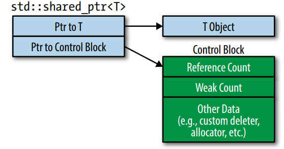
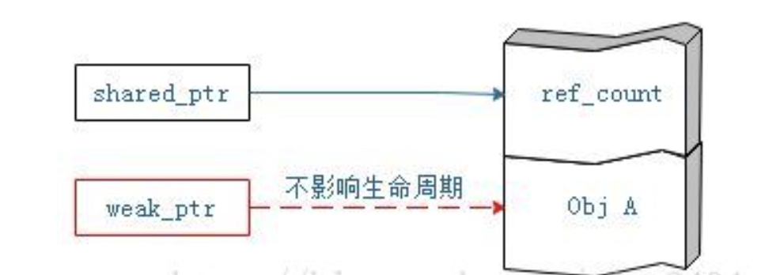

# 一、指针

## （一）智能指针

### 1.why智能指针

可参考：

https://www.cnblogs.com/5iedu/p/11623757.html

https://docs.microsoft.com/zh-cn/cpp/standard-library/weak-ptr-class?view=msvc-160

### 2.智能指针分类

智能指针一共个有四种 

1. unique_ptr

2. shared_prt

3. weak_prt

4. auto_ptr

    

#### （1）unique_ptr独占型智能指针

##### 1）特点

1. unique_ptr是一个独享所有权的智能指针（指针独占对象），无法进行拷贝构造、赋值操作操作，只能进行移动操作。无法使两个unique_ptr指向同一个对象。
2. unique_ptr智能指向一个对象，如果当它指向其他对象时，之前所指向的对象会被摧毁。
3. unique_ptr对象会在它们自身被销毁时使用删除器自动删除它们管理的对象。

##### 2）初始化

1. 直接初始化：unique<T> myPtr(new T);  //ok。但不能通过隐式转换来构造，如unique<T> myPtr = new T()。因为unique_ptr构造函数被声明为explicit。

  2. 移动构造：unique<T> myOtherPtr = std::move(myPtr);但不允许复制构造，如unique<T> myOther = myPtr; 因为unique是个只移动类型。

  3. 通过make_unique构造：unique<T> myPtr = std::make_unique<T>(); //C++14支持的语法。但是make_都不支持添加删除器，或者初始化列表。

  4. 通过reset重置：如std::unique_ptr up; up.reset(new T());

##### 3）指定删除器

1. unique_ptr<T,D>  u1(p,d);删除器是unique_ptr类型的组成部分，可是普通函数指针或lambda表达式。注意，当指定删除器时需要同时指定其类型，即D不可省略。
2. 使用默认的deleter时，unique_ptr对象和原始指针的大小是一样的。当自定义deleter时，如果deleter是函数指针，则unique_ptr对象的大小为8字节。对于函数对象的deleter，unique_ptr对象的大小依赖于存储状态的多少，无状态的函数对象（如不捕获变量的lambda表达式），其大小为4字节。

##### 4）常用操作

1. get()：返回unique_ptr中保存的裸指针
2. reset()：重置unique_ptr。

3. release()：放弃对指针的控制权，返回裸指针，并将unique_ptr自身置空。通常用来初始化另一个智能指针。

4. swap(q)：交换两个智能指针所指向的对象。

##### 5）示例代码

```c++
class Widget{

};

int main(){
   
    std::unique_ptr<Widget> upw1;

    upw1.reset(new Widget);

    std::unique_ptr<Widget> upw2(new Widget);
    cout <<"before swap..." << endl;
    cout << "upw1.get() = " << hex << upw1.get() << endl;
    cout << "upw2.get() = " << hex << upw2.get() << endl;

    cout << "after swap..." << endl;
    upw1.swap(upw2); //交换指针所指的对象
    cout << "upw1.get() = " << hex << upw1.get() << endl;
    cout << "upw2.get() = " << hex << upw2.get() << endl;

    cout << "remove upw2 controller..." << endl;
    upw1.reset(upw2.release()); //转移所有权

    cout << "upw1.get() = " << hex << upw1.get() << endl;
    cout << "upw2.get() = " << hex << upw2.get() << endl;

    cout <<"delete upw1..." << endl;
    upw1 = nullptr; //释放upw1指向的对象，并将upw1置空
    upw1.reset(nullptr);
    cout << "upw1.get() = " << hex << upw1.get() << endl;
}
```

#### （2）shared_ptr共享型智能指针

##### 1）剖析shared_ptr

shared_ptr包含两个指针，一个是存储着指向对象的指针，另一个是指向控制块的指针。

因此，shared_ptr大致的内存模型如下：



储存着指向对象的指针理解起来较为简单，主要说明一个由std::shared_ptr管理的对象都有一个**控制块**，这个控制块

拥有资源的 `shared_ptr` 对象共享控制块。 控制块包含：

- 拥有该资源的 `shared_ptr` 对象的数目，
- 指向该资源的 `weak_ptr` 对象的数目；
- 该资源的删除器（如果有），
- 控制块的自定义分配器（如果有）。

##### 2）特点

1. shared_ptr是一个共享所有权的智能指针（多指针共享一个对象），可以拷贝构造、赋值操作操作，存在一个引用计数用于记录当前还有多少指针指向该对象。

    

##### 3）初始化

- 直接初始化：

```c++
shared_ptr<T> sp;
sp.reset(new T());

shared_ptr<T> sp(new T());
```

- 拷贝构造：

```c++
shared_ptr<T> sp1 = sp; //拷贝构造
```

- 通过make_shared构造

```c+
auto sp = make_shared<int>(10);
```

##### 4）指定删除器

1.  shared_ptr<T> sp1(q, deleter1);与unique_ptr不同，**删除器不是shared_ptr类型的组成部分**。假设，shared_ptr<T> sp2(q,deleter2)，尽管sp1和sp2有着不同的删除器，但两者的类型是一致的，都可以被放入vector<shared_ptr<T>>类型的同一容器里。
2.  与std::unique_ptr不同，自定义删除器不会改变std::shared_ptr的大小。**其始终是祼指针大小的两倍**。
3.  当使用shared_ptr**管理动态数组**时，需要指定删除器。因为默认删除器不支持数组对象。如shared_ptr<int> sp(new int[10], std::default_delete<**int[]**>);
4.  删除器可以是普通函数、函数对象和lambda表达式等。默认的删除器为std::default_delete，其内部是通过delete来实现功能的。

##### 5）示例代码

```c++
int main(){
		int a = 10;
    std::shared_ptr<int> ptra = std::make_shared<int>(a);
    std::shared_ptr<int> ptra2(ptra); //copy
    std::cout << ptra.use_count() << std::endl;
    std::cout << ptra2.use_count() << std::endl;
    std::cout << ptra.get() << std::endl;
    std::cout << ptra2.get() << std::endl;

    int b = 20;
    int *pb = &a;
    //std::shared_ptr<int> ptrb = pb;  //error
    std::shared_ptr<int> ptrb = std::make_shared<int>(b);
    std::cout << ptra.use_count() << std::endl;

    ptra2 = ptrb; //assign ptra use_count变为1
    ptrb.get(); //获取原始指针

    std::cout << ptra.use_count() << std::endl;
    std::cout << ptrb.use_count() << std::endl;
    std::cout << ptra2.use_count() << std::endl;
}
```


#### （3）weak_ptr弱类型型智能指针

##### 1）剖析weak_ptr

weak_ptr是弱智能指针对象，它不控制所指向对象生存期的智能指针，它指向由一个shared_ptr管理的智能指针。

将一个weak_ptr绑定到一个shared_ptr对象，不会改变shared_ptr的引用计数。一旦最后一个所指向对象的shared_ptr被销毁，所指向的对象就会被释放，即使此时有weak_ptr指向该对象，所指向的对象依然被释放。



##### 2）特点

1. weak_ptr不是独立的智能指针，它是shared_ptr的助手，只是监视shared_ptr管理的资源是否释放，**不会影响强引用计数**，不能管理资源。
2. weak_ptr**没有重载操作符\*和->**，因为它不共享指针，不能操作资源。
3. weak_ptr主要**用来代替可能空悬的shared_ptr**。

##### 3）初始化

- 直接初始化：

```c++
weak_ptr<T> wp(sp); //其中sp为shared_ptr类型
```

- 赋值初始化

作者：宋大壮
链接：https://www.jianshu.com/p/234b818f289a
来源：简书
著作权归作者所有。商业转载请联系作者获得授权，非商业转载请注明出处。


```c++
wp1 = sp;  //其中sp为shared_ptr类型

wp2 = wp1; //其中wp1为weak_ptr类型
```

##### 4)常用操作

1. use_count()：获取当前控制块中资源的强引用计数。
2. expired()：判断所观测的资源**是否失效**（即己经被释放），即use_count是否为0。
3. shared_ptr<int> sp1 = wp.**lock()**;//**如果wp失效,则sp为空**（其中wp为weak_ptr类型）
4. shared_ptr<int> sp2(wp); //**如果wp失效，则抛std::bad_weak_ptr异常**。
5. lock()：**获取所监视资源的shared_ptr**，如shared_ptr<int> sp = wp.lock(); //wp为weak_ptr类型。
6. reset()：重置weak_ptr，**影响弱引用计数**。

##### 5)示例代码

```c++
class Widget{

};

int main(){
  	auto sp1 = make_shared<Widget>();

    weak_ptr<Widget> wp(sp1);  //通过shared_ptr初始化
    weak_ptr<Widget> wp1, wp2;
    cout << wp.use_count() << endl; //1，强引用计数

    auto sp3 = sp1;
    wp1 = sp1;   //利用shared_ptr来赋值
    wp2 = wp;    //利用weak_ptr赋值

    cout << wp.use_count() << endl; //2，强引用计数
    cout << wp2.use_count() << endl; //2，强引用计数

    auto sp2 = wp2.lock(); //sp2为shared_ptr类型
    cout << wp2.use_count() << endl; //3，强引用计数

    sp1 = nullptr;

    cout << wp2.use_count() << endl; //2，强引用计数

    return 0;
}

输出
  1
  2
  2
  3
  2
```


### 函数重载(overload function)

#### 函数重载的概念：

##### 概念：

当函数具有相同的名称，但是参数列表不相同的情形（包括参数的个数不同或参数的类型不同），这样的同名而不同参数的函数之间，互相被称之为重载函数。

##### 基本条件：

- 函数名必须相同；
- 函数参数必须不相同，可以是参数类型或者参数个数不同；
- 函数返回值可以相同，也可以不相同。（备注：但是如果函数的名称和参数完全相同，仅仅是返回值类型不同，是无法进行函数重载的。）

##### 注意：

- 只能通过不同的参数样式进行重载，例如：不同的参数类型，不同的参数个数，或者不同的参数顺序；
- 不能通过访问权限、返回类型、抛出的异常不同而进行重载；
- 重载的函数应该在相同的作用域下。

##### 函数重载实例判断：

以下的集中写法，分别表示了哪些是重载的，哪些不是重载的。
(1) void func1( int arg1);
(2) void func1( double arg1);
(3) void func1( int arg1, int arg2);
(4) bool func1(int arg1, double arg2)
(5) int func1(int arg1);

在上述的5个函数中，函数名称都是func1，完全相同；但是：
(2)与(1)的参数个数相同，参数类型不同，构成重载；
(3)与(1)和(2)的参数个数不同，构成重载；
(4)与(1)和(2)的参数个数不同，与(3)的参数个数相同，但是第二个参数类型不同，构成重载；
(5)与(1)的参数个数和参数类型均相同，仅返回值的类型不相同，不构成重载；但是(5)与(2),(3)和(4)除返回值不同外，均有参数类型或参数个数不同的情况，因此构成重载关系。

### 函数重写（override function）

虽然与函数重载仅仅只有一个字的差别，但是这两个概念却是相差了很远很远。它俩似乎一点关系都没有。也正因为如此，这个非常考验C++语言的基本功，也是历年C++笔试中经常会出现的考题。

#### 函数重写(override function)

##### 概念：

函数重写，也被称为覆盖，是指子类重新定义父类中有相同名称和参数的虚函数，主要在继承关系中出现。

##### 基本条件：

- 重写的函数和被重写的函数必须都为virtual函数，并分别位于基类和派生类中；
- 重写的函数和被重写的函数，函数名和函数参数必须完全一致；
- 重写的函数和被重写的函数，返回值相同，或者返回指针或引用，并且派生类虚函数返回的指针或引用的类型是基类中被替换的虚函数返回的指针或引用的类型的字类型。


### 函数重载（overload）

函数重载是指在一个类中声明多个名称相同但参数列表不同的函数，这些的参数可能个数或顺序，类型不同，但是不能靠返回类型来判断。特征是：
（1）相同的范围（在同一个作用域中）；
（2）函数名字相同；
（3）参数不同；
（4）virtual 关键字可有可无（注：函数重载与有无virtual修饰无关）；
（5）返回值可以不同；

###  函数重写（也称为覆盖 override）

函数重写是指子类重新定义基类的虚函数。特征是：

（1）不在同一个作用域（分别位于派生类与基类）；
（2）函数名字相同；
（3）参数相同；
（4）基类函数必须有 virtual 关键字，不能有 static 。
（5）返回值相同，否则报错；
（6）重写函数的访问修饰符可以不同；

重载与覆盖的区别：

(1)覆盖是子类和父类之间的关系，是垂直关系；重载是同一个类中不同方法之间的关系，是水平关系；

(2)覆盖要求参数列表相同，重载要求参数列表不同；覆盖要求返回类型相同，重载则不要求；

(3)覆盖关系中，调用方法体是根据对象的类型（基类类型还是派生类类型）来决定的，重载关系是根据调用时的实参表与形参表来选择方法体的。

###  重定义（也称隐藏）

（1）不在同一个作用域（分别位于派生类与基类） ；
（2）函数名字相同；
（3）返回值可以不同；
（4）参数不同。此时，不论有无 virtual 关键字，基类的函数将被隐藏（注意别与重载以及覆盖混淆）；

（5）参数相同，但是基类函数没有 virtual关键字。此时，基类的函数被隐藏（注意别与覆盖混淆）；

```c++
#include <iostream>
using namespace std;
 
class Base
{
public:
	void a()
	{
		cout << "void Base::a()" << endl;
	}
	//重载了上面的void a()函数,发生在同一个类中
	void a(int i)
	{
		cout << "void Base::a(int i)" << endl;
	}
	virtual void b()
	{
		cout << "virtual void Base::b()" << endl;
	}
	virtual void c()
	{
		cout << "virtual void Base::c()" << endl;
	}
	virtual void d()
	{
		cout << "virtual void Base::d()" << endl;
	}
private:
	int x;
};
class Derived :public Base {
public:
	//在基类Base中，函数a不是虚函数，所以这里是重定义
	void a()
	{
		cout << "void Derived::a()" << endl;
	}
	//参数不同。此时，不论无论有无virtual 关键字，基类的函数将被隐藏，属于重定义
	void b(float f)
	{
		cout << "virtual void Derived::b(float f)" << endl;
	}
	/*
	//编译器报错，也就是说编译器认为函数名和参数都与基类的虚函数c相同，那么返回值也必须相同
	//要么，你就别让编译期认为这是多态，也就是别和基类设置一样的函数名或参数，改变其一即可
	float c()
	{
		cout << "virtual float Derived::c()" << endl;
		return 1.1;
	}
	*/
	//父类中定义了虚函数，子类与父类函数名字相同，参数相同，返回值相同，属于函数重写
	void d()
	{
		cout << "virtual void Derived::d()" << endl;
	}
};
int main()
{
	int i = 6;
	float f = 'a';
	Base base;
	base.a();
	base.a(i);
	base.b();
	base.c();
	base.d();
	Derived derived;
	derived.a();
	derived.b(f);
	derived.d();
	return 0;
}
```

## 函数指针


## 指针函数


**实参(argument)：**

 全称为"实际参数"是在调用时传递给函数的参数. 实参可以是常量、变量、表达式、函数等， 无论实参是何种类型的量，在进行函数调用时，它们都必须具有确定的值， 以便把这些值传送给形参。 因此应预先用赋值，输入等办法使实参获得确定值。    

**形参(parameter)：**

全称为"形式参数" 由于它不是实际存在变量，所以又称虚拟变量。是在定义函数名和函数体的时候使用的参数,目的是用来接收调用该函数时传入的参数.在调用函数时，实参将赋值给形参。因而，必须注意实参的个数，类型应与形参一一对应，并且实参必须要有确定的值。

形式参数：形参是函数被调用时用于接收实参值的变量。

根据实际需要可有可无。没有形参时，圆括号也不可省；多个参数之间应用逗号分隔。参数包括参数名和参数类型。

形参的类型说明可有如下两种格式：

 int max(int a,int b)/*形参的类型在形参表中直接说明*/

  { return (a>b?a:b);}   

 或

  int max(a,b)

  inta,b;     /*形参的类型在函数体前、函数名后说明*/

  { return(a>b?a:b); }

前者为标准格式，后者为传统格式，通常用前者。


**形参和实参的区别**

形参出现在**函数定义**中，在整个函数体内都可以使用， 离开该函数则不能使用。

实参出现在**主调函数中，进入被调函数后，实参变量也不能使用**。 

形参和实参的功能是作数据传送。发生函数调用时， **主调函数把实参的值传送给被调函数的形参从而实现主调函数向被调函数的数据传送**。

1.形参变量只有在被调用时才分配内存单元，**在调用结束时，** **即刻释放所分配的内存单元**。因此，形参只有在函数内部有效。 函数调用结束返回

主调函数后则不能再使用该形参变量。 

2.实参可以是常量、变量、表达式、函数等， 无论实参是何种类型的量，在进行函数调用时，它们都必须具有确定的值， 以便把这些值传送给形

参。 因此应预先用赋值，输入等办法使实参获得确定值。 

3.实参和形参在数量上，类型上，顺序上应严格一致， 否则会发生“类型不匹配”的错误。 

4.**函数调用中发生的数据传送是单向的**。 即只能把实参的值传送给形参，而不能把形参的值反向地传送给实参。 因此在函数调用过程中，形参的值

发生改变，而实参中的值不会变化。

5.当形参和实参不是指针类型时，在该函数运行时，**形参和实参是不同的变量，他们在内存中位于不同的位置，形参将实参的内容复制一份，在该**

**函数运行结束的时候形参被释放，而实参内容不会改变**。

而**如果函数的参数是指针类型变量****,****在调用该函数的过程中，传给函数的是实参的地址，在函数体内部使用的也是实参的地址，即使用的就是实参**

**本身**。所以在函数体内部可以改变实参的值。


## 内存布局


## 静态函数


